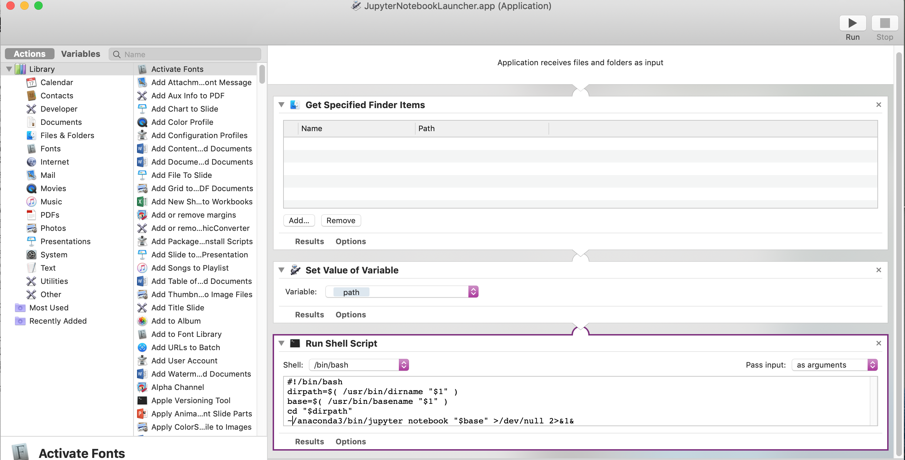

## Killing Jupyter Notebooks running in the background (Mac/Linux)

If you exit out of a Jupyter notebook, it can sometimes leave the program running in the background.  You can kill all currently running notebooks by editing you `.bashrc` command to create a command called `killJupyters`:

`alias killJupyters="jupyter notebook list | sed -E 's/Currently running servers://' | sed -E 's/.*\:([0-9]{4}).*/jupyter notebook stop \1/' | bash"`

Once you have created this command, in any new `bash` shell, you can type `killJupyters` and it will kill any `jupyter notebook` processes running on the computer.

## Forcing Jupyter to run in Chrome on Mac

If you want to force Jupyter to run in Chrome on a Mac, you can edit the
Jupyter configuration files to allow this.  The Jupyter configuration files are in the `~/.jupyter` directory and the specific one you want to edit is

`~/.jupyter/jupyter_notebook_config.py`

Uncomment and change the line for setting the `NotebookApp.browser` variable to read:

`c.NotebookApp.browser = u'/usr/bin/open -a Google\\ Chrome %s'`

## Making .ipynb files "double-clickable" on Mac

You can make it so that when you click an `.ipynb` notebook file in the Finder, it automatically executes Jupyter Notebooks by running the MacOS Automator program and create a new Application with the elements shown in the figure below:

The text in the Run Shell Script window is:

    #!/bin/bash
    dirpath=$( /usr/bin/dirname "$1" )
    base=$( /usr/bin/basename "$1" )
    cd "$dirpath"
    ~/anaconda3/bin/jupyter notebook "$base" >/dev/null 2>&1&

Now save this as an application in `/Applications` (I suggest the name `NotebookLauncher.app`).  Then go to one of your `.ipynb` files, perform a File>Get Info menu command on the file and go to the "Open with" section and tell it to open this file with your `NotebookLauncher` application.  You can click "Change All..." and all Notebook files become double clickable.

